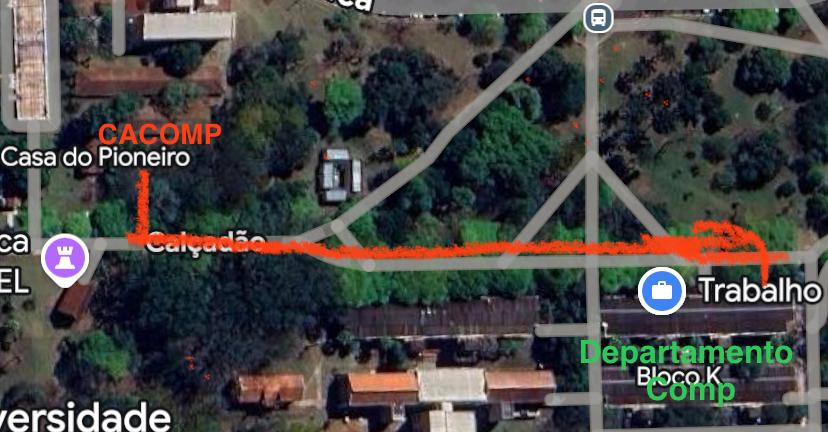

# 🎓 Bem-vindos(as) à Ciência da Computação - UEL

Parabéns por terem chegado à **crUELzinha**! Este guia foi feito por veteranos para que vocês não se percam nos sistemas jurássicos e aproveitem tudo o que o campus oferece desde o primeiro dia.

## 📍 Sumário

📚 [Matérias do 1º Semestre](#materias_1sem)
- [Cálculo Diferencial e Integral I](#calculo1)
- [Algoritmos](#algoritmos)
- [Álgebra Linear](#algebra_linear)
- [Sistemas Digitais I](#sistemas_digitais)
- [Matemática Discreta e Finita I](#discreta1)

🚀 [Atividades Extracurriculares](#extracurriculares)
- [Atlética Exatas e Lolloteria](#atletica)
- [CACOMP (Centro Acadêmico)](#cacomp)
- [CyberLab (Segurança Digital)](#cyberlab)
- [GEMP (Maratona de Programação)](#gemp)
- [IEEE UEL e Capítulos](#ieee)
- [Iniciação Científica (IC)](#ic)
- [PET CODE](#petcode)
- [WIE (Women in Engineering)](#wie)

📱 [Portal e Sistemas](#app_uel)
- [App UEL Mobile](#app_uel)
- [Matrícula e Renovação](#matricula)
- [Boletim e Frequência](#boletim)
- [Carteirinha e Restaurante Universitário (RU)](#carteirinha)
---

# 📚 O Temido (mas amado) 1º Semestre
Calma, ninguém morre no primeiro semestre (pelo menos não literalmente)! Aqui estão as matérias que vão abrir sua cabeça e os caminhos para não ficar de DP.

### 📉 Cálculo Diferencial e Integral I
É a famosa "matemática das mudanças". Aqui você vai entender como as coisas variam usando limites, derivadas e integrais. É a base para modelar qualquer fenômeno real.

**Onde buscar socorro:**
- **Equaciona:** Ótimo para base matemática.
- **Matemateca:** Explicações diretas e sem enrolação.
- **Blackpenredpen (EUA):** Se o seu inglês estiver em dia, esse cara é um gênio das integrais.
- 📺 **Playlist Salva-Vidas:** [Cálculo 1 - Curso Completo](https://www.youtube.com/watch?v=jQI0bsCtdws&list=PLEfwqyY2ox86LhxKybOY3_IG-7R5herLC)

**Material de Apoio:**
- 📂 [Listas de Exercícios (GitHub)](https://github.com/gabryeleite/1-Semestre/blob/main/Listas_Calculo1.zip)
- 📖 [Livro James Stewart (A "Bíblia" do Cálculo)](https://futuraengenheira.wordpress.com/2017/04/14/calculo-james-stewart-7a-edicao-vol-2/)
---
### 💻 Algoritmos
Talvez a matéria mais importante da sua vida acadêmica. É aqui que você aprende a criar "receitas" passo a passo para o computador resolver problemas.

**Dica de Ouro:** Se nunca programou, comece pelo **Gustavo Guanabara** (Portugol). A didática dele é imbatível para iniciantes. Depois que entender a lógica, pule para o **C** com os outros canais.

**Canais:**
- [Curso em Vídeo (Guanabara)](https://www.youtube.com/@CursoemVideo)
- [De Aluno para Aluno (Focado em C)](https://www.youtube.com/@DeAlunoParaAluno)
- [Programe seu Futuro](https://www.youtube.com/@programeseufuturo)

**Recursos:**
- 🚀 **Beecrowd:** O site oficial para passar raiva (e aprender muito) resolvendo exercícios. [Acesse aqui](https://www.beecrowd.com.br/).
- 📚 [Exercícios e Códigos Prontos](https://github.com/gabryeleite/1-Semestre/blob/main/Codigos.zip)

> **📖 Leitura Recomendada:**
> 
> - _"Entendendo Algoritmos"_ (Aditya Bhargava): Tem desenhos e ajuda a visualizar como os dados se organizam.
>     
> - _"Introdução à Programação em C"_ (Maurício Aniche): Bom para quando você já tiver uma base e quiser montar uns joguinhos.
>     

---

### 📐 Álgebra Linear

Aqui você trabalha com matrizes e vetores para manipular muitos dados ao mesmo tempo. Essencial para computação gráfica e algoritmos de recomendação.

- 📺 **Playlist Recomendada:** [Álgebra Linear - Matemateca](https://www.youtube.com/watch?v=GS_ZH1CQ0SY&list=PLmtT_GZAQdt-9QNWJw1vzJldnuyGmdidq)
---

### 🔌 Sistemas Digitais I
É aqui que você descobre que o computador só entende `0` e `1`. Você vai aprender sobre portas lógicas e circuitos elétricos.

- **Dica:** Os slides do Prof. Elieser são excelentes, foquem neles!
- 🛠️ **Softwares:** [CEDAR Logic](https://sourceforge.net/projects/cedarlogic/) e **Logisim**.
---

### 🧠 Matemática Discreta e Finita I
Trabalha com lógica e conjuntos. É o que treina seu raciocínio para programar melhor.

- **Status:** Fé. Você vai precisar.
- 📖 **Livro:** _Matemática Discreta: Uma Introdução_ (2ª Edição).
---

# 🚀 Além da Sala de Aula: Atividades Extracurriculares
A faculdade não é só DP e café! Existem grupos que ensinam o que o quadro negro não consegue, além de garantirem as **horas complementares** necessárias para se formar.

> **Atenção:** A Atlética e o CACOMP são fundamentais para a sua saúde mental e integração, mas eles **não dão horas complementares**. Participe pelo social!

---

### 🐘 Atlética Exatas e Lolloteria
Nem só de código vive o homem! A **Atlética Exatas** cuida do nosso lazer, esportes e, claro, das festas. Se você toca algum instrumento ou quer aprender do zero, a **Lolloteria** (nossa bateria) está sempre de portas abertas.

- **Instagram Exatas:** [@exatasuel](https://www.instagram.com/exatasuel/)    
- **Instagram Lolloteria:** [@lolloteria](https://www.instagram.com/lolloteria/)
---

### 🏠 CACOMP - Centro Acadêmico
O **CACOMP** é a entidade que representa os alunos. Além de lutar pelos nossos direitos, eles são responsáveis pelos **produtos do curso** (moletons, canecas, camisetas). Fiquem de olho no Instagram para não perder os produtos! E claro, não podemos esquecer do lendário **Churrascomp**, o melhor evento de integração que você vai ver.

O CA tem um **espaço físico** incrível (o "aquário") onde você pode:

- Jogar **Guitar Hero** e outros jogos no intervalo.
- Estudar (ou tentar) com a galera.
- ~~Usar a **geladeira e o micro-ondas** (salva vidas!).~~
- Simplesmente capotar no sofá e dormir entre uma aula e outra.

>  **Mapa do caminho saindo do CCE até o CACOMP. É um pulo, não tem erro!**
>  
> 
  **[@cacompuel](https://www.instagram.com/cacompuel/)   
---

### 🛡️ CyberLab
Se você pira em segurança digital, esse é o seu lugar. O **CyberLab** (Laboratório de Pesquisas e Estudos de Crimes Cibernéticos) foca em entender os riscos da internet, desenvolver apps e materiais educativos para conscientizar a galera sobre privacidade e proteção de dados. É pesquisa de ponta com impacto real na sociedade!

- **Como entrar:** Falar com os professores Possari ou Rodolfo.
---

### 🏆 GEMP - Grupo de Estudos para Maratonas de Programação
A Maratona de Programação é o "esporte de elite" da computação. O **GEMP** serve para te treinar (mesmo se você nunca viu código na vida) para resolver problemas complexos de algoritmos sob pressão. O objetivo é colocar a UEL no topo do Brasil e te preparar para entrevistas em big techs (Google, Meta, etc).

- **Como entrar:** Falar com o professor Marco.
---

### 🤖 IEEE UEL - Ramo Estudantil
O **IEEE** é a maior organização profissional de tecnologia do mundo. No ramo da UEL, nos dividimos em capítulos:

- **CS (Computer Society):** O coração da computação.
- **PES (Power and Energy):** Focado em energia.
- **RAS (Robotics and Automation):** Robótica pura.
- **SSIT (Social Implications of Technology):** Tecnologia voltada para o bem social.

- 🔗 **Instagram:** [@ieeeuel](https://www.instagram.com/ieeeuel/) | **YouTube:** [Ramo IEEE UEL](https://www.youtube.com/RamoIEEEUEL)

---

### 🧬 Iniciação Científica (IC)
Quer pesquisar algo a fundo e ainda ganhar uma bolsa (o famoso 🤑)? Na IC você escolhe um tema e um orientador. É ótimo para quem pensa em fazer mestrado ou quer se especializar muito em uma área.

- **Como entrar?** Mande e-mail ou bata na porta dos professores. Veja quem pesquisa o quê aqui: [Currículo dos Docentes](https://sites.uel.br/dc/docentes-e-tecnicos/)
---

### 💻 PET CODE - Computação e Design
O **PET** une a galera da Comp e do Design em projetos de ensino, pesquisa e extensão. É um grupo muito forte que desenvolve soluções reais, organiza eventos e tem uma vivência acadêmica bem intensa.

- **Instagram:** [@pet_code]([https://www.instagram.com/pet_code/](https://www.instagram.com/petcode_uel?igsh=OG93MWx0YTVldnBi))
- **E-mail:** [petcode@uel.br]
---

### 💜 WIE - Women in Engineering
Um braço do IEEE focado em incentivar mulheres na tecnologia. É um espaço de rede de apoio, eventos e muita representatividade para as meninas da Computação e das Engenharias.

- **Instagram:** [@wie.uel](https://www.instagram.com/wie.uel/)    
---

# 📱 App UEL Mobile
Para você não ficar rodando em círculos no campus ou perdido no sistema da UEL (que parecem ter sido feito na era Jurássica), montamos esse guia rápido sobre o que realmente importa para o seu dia a dia.

O aplicativo oficial é, na maioria das vezes, muito mais prático que o portal web. Ele quebra um galho gigante na hora de ver o cardápio do RU ou mostrar a carteirinha rápido na fila.

- **Android:** [Baixe aqui](https://play.google.com/store/apps/details?id=br.uel.ati.app.uel_mobile&hl=pt_BR)
- **iOS:** [Baixe aqui](https://apps.apple.com/br/app/uel-mobile/id1532054516)

> **Foto do App**
>
> 
---

# 💻 Matrícula e Portal do Estudante

Aqui é onde a "burocracia oficial" acontece. Se precisar de papelada ou resolver a vida acadêmica, o caminho é o **Portal do Estudante de Graduação**.

> **Link de acesso:** [sistemas.uel.br/portaldoestudante](https://sistemas.uel.br/portaldoestudante/)

### Confirmação e Renovação
Não vacile aqui! Todo semestre (e logo agora no começo) você precisa confirmar que está "ativo" no curso:

1. Logue com seu número de matrícula e a senha que você criou.

2. Procure por **Serviços** -> **Confirmação de Matrícula** (ou **Renovação**).

3. Siga o que se pede. Geralmente é só um formulário simples ou um botão de confirmar. É bem tranquilo, mas **perder o prazo significa perder a vaga**, então fiquem atentos aos avisos do centro acadêmico!
---

# 📝 Boletim e Frequência

Quer saber se o professor já postou a nota ou se você está abusando das faltas?

- Caminho: **Serviços** -> **Boletim**.

- **Dica de veterano:** A UEL é rígida com presença. Você precisa de, no mínimo, **75% de frequência**. O boletim mostra o "limite de faltas" de cada matéria, não ultrapasse esse número por nada! Você também consegue ver tudo isso pelo App, o que é bem mais prático.

- Geralmente o numero de máximo faltas é: 9, 18 ou 27. **Mas lembrando que 1 aula conta como 2**.
---

# 💳 Carteirinha e RU
A carteirinha serve para pagar meia no cinema, mas no campus ela é sua chave para o **Restaurante Universitário (RU)**.

- **Ela é digital:** Não precisa de plástico! O QR Code no App UEL Mobile funciona super bem nas catracas. Mas caso queira poderá imprimir ela

- **Ônibus:** Atenção! A carteirinha da UEL **não** serve para o passe livre ou meia no ônibus de Londrina. Para isso, você tem que fazer o cartão escolar pelo sistema da **TCGL**.    

### Créditos para o RU (Onde a mágica acontece)
Se você quer comer bem pagando pouco (o famoso ranguinho da UEL), você precisa carregar créditos na sua conta:

1. **Pelo App:** É o jeito mais fácil. Dá para comprar via PIX e cai na hora.
2. **Pelo Portal:** Vá em **Serviços** -> **Créditos Restaurante Universitário**.
3. **Presencialmente:** Existem uns totens na frente do RU que aceitam cartão de débito/crédito.
---
Por enquanto é isso que vocês precisam para sobreviver ao primeiro semestre de Computação na **crUELzinha**. Nós, veteranos, esperamos poder ajudar nessa nova fase. Se precisarem de qualquer coisa, é só dar um grito!

> **Que comecem os jogos! ;D**
---

#### Créditos

> [Gabryel Leite](https://github.com/gabryeleite) | [Isadora Vanco](https://github.com/IsadoraVanco) | [João Carlos](https://github.com/JCsvg)